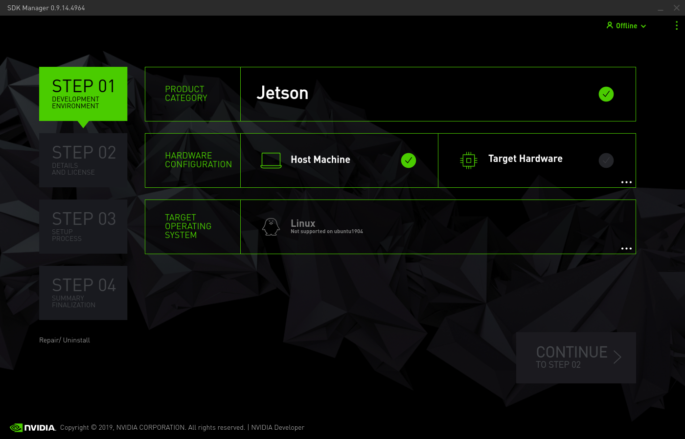
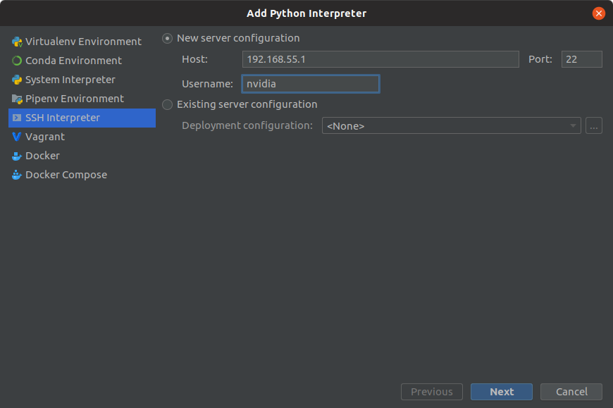
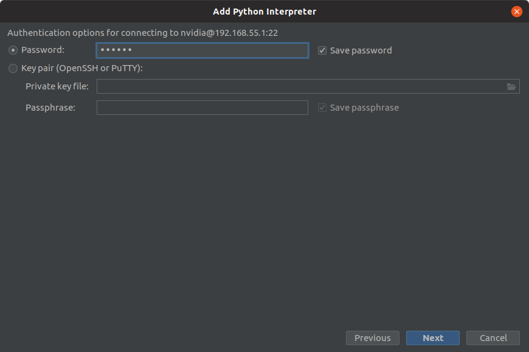
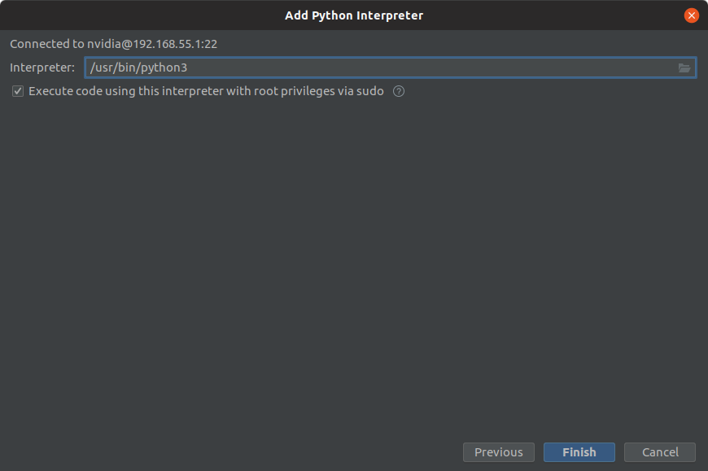
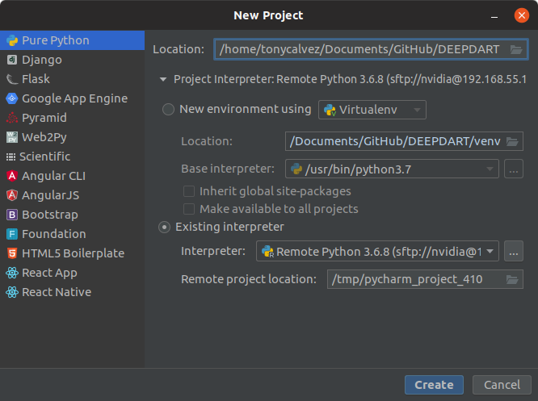

<<<<<<< Updated upstream

# DEEPDART
Buggies with Embedded AI
=======
# DEEPDART 

## JETSON TX2 - DEVELOPER KIT

### INSTALLATION JETPACK 3.3

#### SDK Manager Software :



You need to follow this different step to install :

- The Operating System : JetPack (last release) with the Ubuntu Linux Kernel with an architecture for AARCH64.

  - Flashing the OS with USB cable and the Recovery Mode :
    - Plug the USB cable from the host to the micro-USB
    - Plug the power cable
    - Start the Jetson Developer Kit with the button POWERBIN and click on the button REC simultaneously during 2 secs

- The programs and libraries on the host (Error : unavailable for my Ubuntu 19.04)

- The programs and libraries on the Jetson TX2 

  

#### SDK Manager : Not supported on ubuntu1904 :

To support the NVIDIA Software, you need to change the environment variable in the directory : `/etc/` 

**WARNING** : You need to save now et restore it at the end of this files: `os-release` and `lsb-release`.

Configuration File : 

File : `os-release`

```txt
NAME="Ubuntu"
VERSION="18.04 (Disco Dingo)"
ID=ubuntu
ID_LIKE=debian
PRETTY_NAME="Ubuntu 18.04"
VERSION_ID="18.04"
HOME_URL="https://www.ubuntu.com/"
SUPPORT_URL="https://help.ubuntu.com/"
BUG_REPORT_URL="https://bugs.launchpad.net/ubuntu/"
PRIVACY_POLICY_URL="https://www.ubuntu.com/legal/terms-and-policies/privacy-policy"
VERSION_CODENAME=disco
UBUNTU_CODENAME=disco
```

File : `lsb-release`

```txt
DISTRIB_ID=Ubuntu
DISTRIB_RELEASE=18.04
DISTRIB_CODENAME=bionic
DISTRIB_DESCRIPTION="Ubuntu 18.04 LTS"
```

Restart your software and download !

---------------------------

## CHECK THIS INSTALLATION AND THE SAMPLES ON THE JETPACK TX2

You can start improve the NVIDIA Softwares with CUDA and VisionWorks with their repositories :

- Cuda
- VisionWorks

This is a very good tutorial : https://www.youtube.com/watch?v=KROP46Wte4Q

------------------------

## LIBRARIES POUR LE GGPU TEGRA X2 

Download link : https://developer.nvidia.com/embedded/downloads#/search=tensorflow

#### TensorFlow for JetPack : 

Documentations : https://docs.nvidia.com/deeplearning/frameworks/install-tf-jetson-platform/index.html

**Installation :** 

This TensorFlow have been compiled for the Jetson TX2 (aarch64) and the CUDA's Driver V10.0 only.

Official package (old version): [tf_gpu-1.14.0+nv19.7-py3](https://developer.download.nvidia.com/compute/redist/jp/v42/tensorflow-gpu/tensorflow_gpu-1.14.0+nv19.7-cp36-cp36m-linux_aarch64.whl)

Newest version homebrew aarch64 compilation : https://github.com/lhelontra/tensorflow-on-arm/releases

#### Camera for JetPack : 

You need to download the Multimedia Drivers with the JetPack Software.

```bash
gst-launch-1.0 nvarguscamerasrc ! 'video/x-raw(memory:NVMM),width=3820, height=2464, framerate=21/1, format=NV12' ! nvvidconv flip-method=0 ! 'video/x-raw,width=960, height=616' ! nvvidconv ! nvegltransform ! nveglglessink -e
```


----------------------------------

## REMOTE YOUR PROJECT

### THE SSH POWER WITHOUT ANY PROBLEEEEM (OF IP)

The JetPack OS contains an virtual network card in USB.

You can plug your computer and the TX2 with USB and start a SSH :

```
ssh nvidia@192.168.55.1
```


### PYCHARM PROFESSIONAL 

I don't have any benefits to recommend the professional release of PyCharm. [But if you're student, you have a free access to this version.](https://www.jetbrains.com/community/education/)

With this release, you can remote your work with the SSH. LET'S START!!









