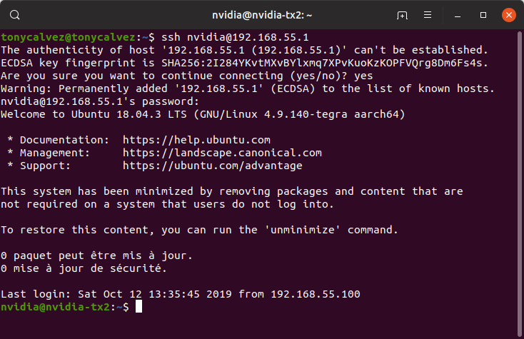

# DEEPDART 

Contest : www.hackster.io/contests/NVIDIA

## JETSON TX2 - DEVELOPER KIT

### INSTALLATION JETPACK 3.3

#### SDK Manager Software :


You need to follow this different step to install :

- The Operating System : JetPack (last release) with the Ubuntu Linux Kernel with an architecture for AARCH64.

  - Flashing the OS with USB cable and the Recovery Mode :
    - Plug the USB cable from the host to the micro-USB
    - Plug the power cable
    - Start the Jetson Developer Kit with the button POWERBIN and click on the button REC simultaneously during 2 secs

- The programs and libraries on the host (Error : unavailable for my Ubuntu 19.04)

- The programs and libraries on the Jetson TX2 

  

#### SDK Manager : Not supported on ubuntu1904 :

To support the NVIDIA Software, you need to change the environment variable in the directory : `/etc/` 

**WARNING** : You need to save now et restore it at the end of this files: `os-release` and `lsb-release`.

Configuration File : 

File : `os-release`

```txt
NAME="Ubuntu"
VERSION="18.04 (Disco Dingo)"
ID=ubuntu
ID_LIKE=debian
PRETTY_NAME="Ubuntu 18.04"
VERSION_ID="18.04"
HOME_URL="https://www.ubuntu.com/"
SUPPORT_URL="https://help.ubuntu.com/"
BUG_REPORT_URL="https://bugs.launchpad.net/ubuntu/"
PRIVACY_POLICY_URL="https://www.ubuntu.com/legal/terms-and-policies/privacy-policy"
VERSION_CODENAME=disco
UBUNTU_CODENAME=disco
```

File : `lsb-release`

```txt
DISTRIB_ID=Ubuntu
DISTRIB_RELEASE=18.04
DISTRIB_CODENAME=bionic
DISTRIB_DESCRIPTION="Ubuntu 18.04 LTS"
```

Restart your software and download !

-----------------------------------------------------------------------------------------

### CHECK THIS INSTALLATION AND THE SAMPLES ON THE JETPACK TX2

You can start improve the NVIDIA Softwares with CUDA and VisionWorks with their repositories :

- Cuda
- VisionWorks

This is a very good tutorial : https://www.youtube.com/watch?v=KROP46Wte4Q

------------------------

## LIBRARIES FOR THE GGPU TEGRA X2 

Download link : https://developer.nvidia.com/embedded/downloads#/search=tensorflow

#### TensorFlow for JetPack : 

Documentations : https://docs.nvidia.com/deeplearning/frameworks/install-tf-jetson-platform/index.html

**Installation :** 

This TensorFlow have been compiled for the Jetson TX2 (aarch64) and the CUDA's Driver V10.0 only.

Official package : [tensorflow_gpu-1.14.0+nv19.9-cp36-cp36m-linux_aarch64.whl](https://developer.download.nvidia.com/compute/redist/jp/v42/tensorflow-gpu/tensorflow_gpu-1.14.0+nv19.9-cp36-cp36m-linux_aarch64.whl) 

-- The homebrew compilation for TensorFlow 2.0 isn't stable.

After test, I think the best is uninstall the package in JetPack OS and download the latest release : 1.14:

```
pip3 uninstall tensorflow
pip3 install tensorflow_gpu-1.14.0+nv19.9-cp36-cp36m-linux_aarch64.whl
```


#### Camera for JetPack : 

You need to download the Multimedia Drivers with the JetPack Software.

```bash
gst-launch-1.0 nvarguscamerasrc ! 'video/x-raw(memory:NVMM),width=3820, height=2464, framerate=21/1, format=NV12' ! nvvidconv flip-method=0 ! 'video/x-raw,width=960, height=616' ! nvvidconv ! nvegltransform ! nveglglessink -e
```

The `nvarguscamerasrc` is a pipeline used when the camera generates images of the bayer format, because it uses the ISP to change the images to a visible format.

The best solution to stream the camera with an other software is captured in v4l2src format and export in the `\dev\video2`

```bash
cd ..
mkdir v4l2src
cd v4l2src
git clone https://github.com/umlaeute/v4l2loopback.git v4l2loopback
cd v4l2loopback
sudo su
make
make install 

# The best tutorial : https://www.viziochron.com/xavier
apt-get install -y v4l2loopback-dkms v4l2loopback-utils
modprobe v4l2loopback devices=1 video_nr=2 exclusive_caps=1
echo options v4l2loopback devices=1 video_nr=2 exclusive_caps=1 > /etc/modprobe.d/v4l2loopback.conf
echo v4l2loopback > /etc/modules
update-initramfs -u
```


It's good, you're ready to stream your camera with `/dev/video2` with this command line : 

```bash
gst-launch-1.0 -v nvarguscamerasrc ! 'video/x-raw(memory:NVMM), format=NV12, width=1920, height=1080, framerate=30/1' ! nvvidconv ! 'video/x-raw, width=640, height=480, format=I420, framerate=30/1' ! videoconvert ! identity drop-allocation=1 ! 'video/x-raw, width=640, height=480, format=RGB, framerate=30/1' ! v4l2sink device=/dev/video2
```


You can check your software installation with : 

```bash
gst-launch-1.0 v4l2src device=/dev/video2 ! 'video/x-raw, format=RGB, width=640, height=480, framerate=30/1' ! queue ! videoconvert ! xvimagesink
```

--------------------

## REMOTE YOUR PROJECT

### THE SSH POWER WITHOUT ANY PROBLEEEEM (OF IP)

The JetPack OS contains an virtual network card in USB. 

You can plug your computer and the TX2 with USB and start a SSH :

```
ssh nvidia@192.168.55.1
```



If the partition L4T-README have been monted with your computer, you can follow this instruction. Else you need to reboot your computer.

### PYCHARM PROFESSIONAL 

I don't have any benefits to recommend the professional release of PyCharm. [But if you're student, you have a free access to this version.](https://www.jetbrains.com/community/education/)

With this release, you can remote your work with the SSH. LET'S START!!


Directly in the main menu in Pycharm : 

Go to File -> Settings -> Build, Execution, Deployment -> Deployment, and change deployment path on the Mappings tab.


Make sure that the recent edition of your code is deployed on the server. You can always deploy your code from Tools -> Deployment -> Upload to ..., or by using Ctrl + Shift + Alt + x.


